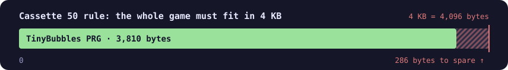

<div align="center">

**English** · [Français](README.fr.md)

# TinyBubbles

**A Puzzle Bobble-style game for the Commodore 64, in 6502 assembly.<br>The whole game is a 3,810-byte PRG: under 4 KB.**

🏆 **Winner of [The C64 'Cassette 50' Charity Competition](https://itch.io/jam/the-c64-cassette-50-charity-competition) (2021)**

[](https://spixs.itch.io/tinybubbles)


<sub>The first 14 shots of a real game in VICE, up to a 130-point combo.</sub>

[Play](#play) · [4 KB](#the-4-kb-challenge) · [Rules](#rules) · [Under the hood](#under-the-hood) · [Building](#building)

</div>

---

## Play

Download it on **[itch.io](https://spixs.itch.io/tinybubbles)**, or use the disk image in this repository, [`bin/Bubble.d64`](bin/Bubble.d64):

```sh
x64sc -autostart bin/Bubble.d64
```

On a real machine (or an Ultimate 64):

```basic
LOAD"*",8,1
```

…and that's it: **no `RUN`**, the game starts by itself as soon as it has loaded ([here's how](#starting-without-run)).

| Joystick (port 2) | Action |
|:---:|---|
| ⬅️ ➡️ | move the crosshair along its arc |
| 🔴 Fire | shoot the bubble |

## The 4 KB challenge

TinyBubbles was written for **The C64 'Cassette 50' Charity Competition**, run on itch.io from December 2020 to March 2021 by [Phoenix Ware](https://www.phoenixware.co.uk/product/cassette-50-collectors-usb-tape/) and The RVG Squad. The idea was a tribute to *Cassette 50*, Cascade's infamous 1983 compilation of fifty games. The rule: **every game had to fit in 4 KB**.

<div align="center">

</div>

TinyBubbles took **first place overall**. It is one of the 56 games on the *Cassette 50+ Collectors USB Tape*, whose proceeds go to the Special Effect charity.

## Rules

- The bubble flies towards the crosshair, **bounces off the walls** and sticks to the first bubble (or the ceiling) it touches.
- **Three or more bubbles of the same colour** touching? They flash, then pop: **10 points** each.
- Bubbles no longer hanging from the ceiling **fall**: **20 points** each.
- Clear the board: a bell rings and the next level loads. The **3 levels** loop, and the level counter keeps climbing.
- A bubble that sticks too low (from the 10th row down) ends the game: back to level 1, score reset. The **HISCORE** stays.

<div align="center">
  
<br><sub>The three levels, 24 bytes each.</sub>
</div>

## Under the hood

The PRG loads from `$0120` to `$0FFF`: right on top of the stack, over the system vectors and all the way through screen memory. The game squeezes into the nooks of the first 4 KB of RAM:

<div align="center">

</div>

### Starting without RUN

The file starts at `$0120`, so it overwrites the stack while it is being loaded. Two well-placed bytes at `$01F8` replace the return address of the Kernal `LOAD` routine: when it finishes, its `RTS` "returns"… into the game.

```asm
// Modify the stack so that the load routine branches to our entry point after
// it has complete its loading.
*=$1f8 "Stack override"
    .byte <[Entry-1], >[Entry-1]
```

Since the file also runs through pages 2 and 3, it carries the default values of the Kernal vectors (`$028F`, `$0314`–`$0329`), so the Kernal keeps working while the load is in progress.

### Everything runs in the interrupt

The main loop is a single instruction:

```asm
mainLoop: {
    jmp *
}
```

Everything else (joystick, trajectory, popping, score, sound) runs in a **raster interrupt** at line 252, once per frame. To know when the bubble hits something, there is no distance check: the **VIC-II** reports the collision between the sprite and the background (`$D01F`).

### A hexagonal grid and a recursion on a leash

The playfield is an **8 × 10 bubble grid** in zero page, staggered: every other row is shifted by half a bubble. One byte per cell: `$80` for empty, the colour otherwise, plus two marker bits for the traversals.

Two recursive traversals (find the same-coloured bubbles to pop, then the ones still hanging from the ceiling) share the same six-neighbour walk through an indirect jump. The stack is limited to 32 bytes during initialisation. After that, it gets the whole of page 1, including the space of the init code, which is no longer needed. And the recursion checks that enough stack is left before going deeper:

```asm
recurseFunction: {
    tsx
    cpx #$06
    bcs !+
    rts // not enough space in stack... stop recurce !

!:
    jmp (functionVector)
functionVector:
    .word $00
}
```

### Aiming and bouncing

The crosshair follows a **sine arc** whose table is computed by the assembler itself:

```asm
SINE_SIGHT_SCREEN_LOOKUP: {
.fill 32,round(26*sin(toRadians(i*192/32)))
}
```

On firing, the bubble → crosshair vector becomes a **fixed-point** velocity (shifted 5 bits, on 16 bits). Bouncing off a wall just flips `DX`.

### The SID as a die

There is no pseudo-random generator: SID voice 3 runs **white noise at maximum frequency**, gate closed, and `$D41B` returns its output. That's what picks the colour of the next bubble and the pitch of the "pop". The other two sound effects are a noise explosion (voice 2) and a **ring-modulated** bell (voice 1 modulated by voice 3) at the end of each level.

### Graphics

<div align="center">

</div>

The background is a **48-character multicolour charset**, drawn with CharPad: brick walls, frames, digits and just the letters needed. The "O" in `SCORE` and the "I" in `HISCORE` are actually the digits `0` and `1`. A bubble is **4 characters** (`$0A`–`$0D`) tinted through colour RAM. Only the player's bubble, the crosshair and the two halves of the launcher are **sprites**.

### Small savings

| Trick | Detail |
|---|---|
| Packed levels | 2 bubbles per byte (one nibble each, `$8`–`$F` = empty): **24 bytes** per level, unpacked into the grid on load. |
| Score on screen | Charset codes 0 to 9 are the digits: the score, kept one digit per byte, is copied as-is to the screen, and the level counter is incremented **directly in screen RAM**. |
| Hidden sprites | The bubble and crosshair images live in the **tape buffer** area (`$0380`, `$03C0`). |
| Self-modifying code | `InitWindow` rewrites the operand of its own `sta` to step down one screen row. |
| Kernal bypassed | The IRQ handler restores the registers itself and ends with `RTI`: the Kernal interrupt routine (keyboard, cursor) no longer runs. |

## Building

With [KickAssembler](http://theweb.dk/KickAssembler/) **5.16** (the original version):

```sh
java -jar KickAss.jar main2.asm -odir bin
```

The `.disk` directive writes `bin/Bubble.d64` directly. The result is **byte-for-byte identical** to the February 3rd, 2021 build kept in this repository.

The graphics come from CharPad (`project*.ctm`) and are imported as-is (`.import binary`): `assets/charset.bin` at `$0800`, `assets/map.bin` straight into screen memory at `$0400`.

## Repository layout

```
main2.asm          the game, final version
main.asm           the previous version (older charset, no .disk)
main_big.asm       an early skeleton: memory map and multicolour mode
assets/            charset and screen exported from CharPad (charset1/map1 = main.asm version)
bin/               builds: Bubble.d64 (main2), main.prg (main), VICE symbols, logs
builds/            intermediate builds recovered from the original USB stick
disk.d64           disk image of the January 29th build of main.asm
project*.ctm       CharPad projects
media/             images for this README
```

## Credits

Written in 2021 by **Pixs** (S. Mametz).
Tools: [KickAssembler](http://theweb.dk/KickAssembler/) (Mads Nielsen), CharPad (Subchrist Software), [VICE](https://vice-emu.sourceforge.io/).

<sub>The images in this README were captured in VICE 3.7.1: a game played by a small bot that drives the joystick reads through the emulator's binary monitor. For levels 2 and 3, the grid was emptied through the monitor, then the game itself loaded the next level. The charset and sprites are decoded straight from the binary.</sub>
