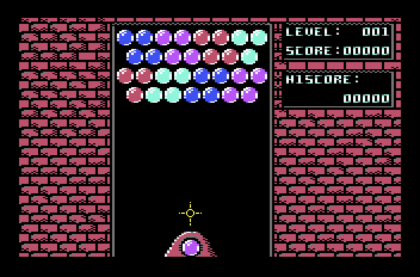
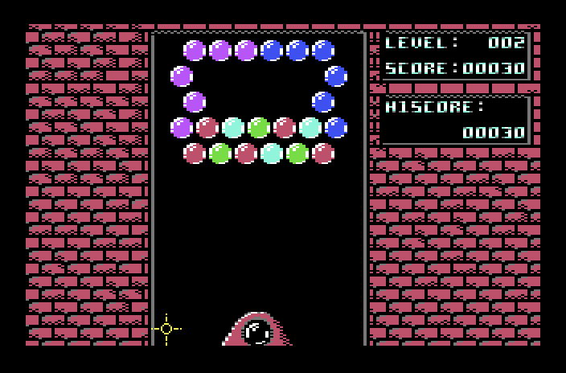
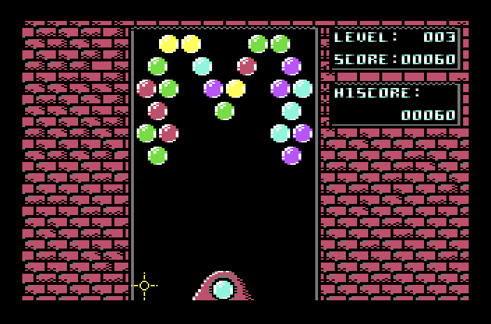
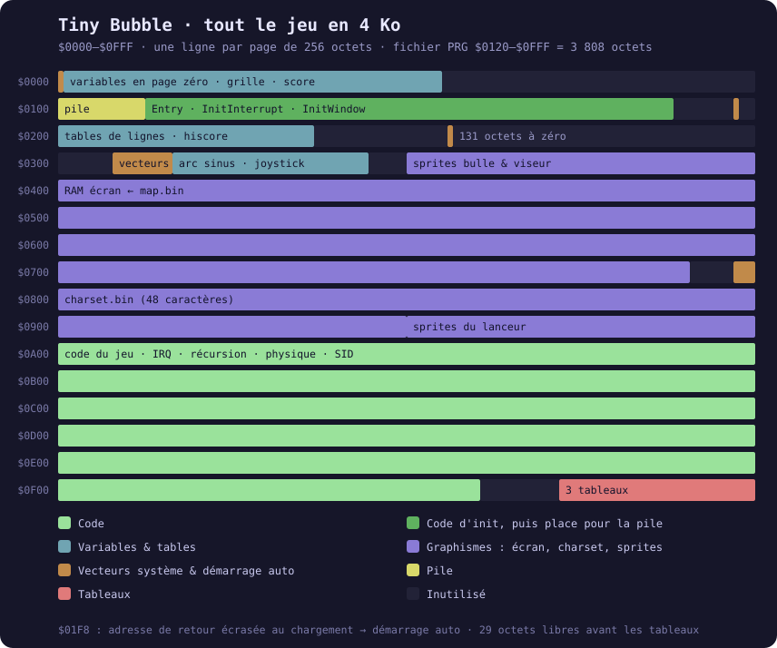
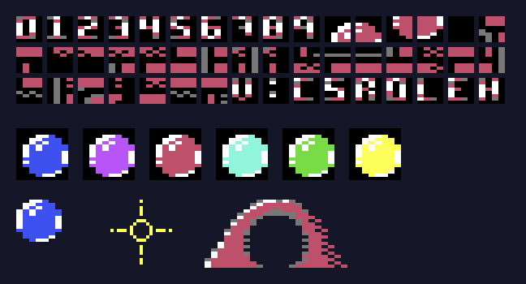

<div align="center">

# Tiny Bubble

**Un jeu de bulles à la *Puzzle Bobble* pour Commodore 64, écrit en assembleur 6502.<br>Le jeu entier tient sous `$1000`.**




<sub>Les 14 premiers tirs d'une vraie partie dans VICE, jusqu'à un combo à 130 points.</sub>

[Jouer](#jouer) · [Règles](#règles) · [Sous le capot](#sous-le-capot) · [Construire](#construire) · [Archéologie](#archéologie)

</div>

---

## Jouer

L'image disque est prête dans [`bin/Bubble.d64`](bin/Bubble.d64).

```sh
x64sc -autostart bin/Bubble.d64
```

Sur une vraie machine (ou une Ultimate 64) :

```basic
LOAD"*",8,1
```

…et c'est tout : **pas de `RUN`**, le jeu démarre tout seul à la fin du chargement ([voir comment](#démarrer-sans-run)).

| Joystick (port 2) | Action |
|:---:|---|
| ⬅️ ➡️ | déplacer le viseur le long de son arc |
| 🔴 Feu | tirer la bulle |

## Règles

- La bulle part vers le viseur, **rebondit sur les murs** et se colle à la première bulle (ou au plafond) qu'elle touche.
- **Trois bulles ou plus de la même couleur** se touchent ? Elles clignotent, puis éclatent : **10 points** chacune.
- Les bulles qui ne tiennent plus au plafond **tombent** : **20 points** chacune.
- Tableau vidé : une cloche retentit et le niveau suivant se charge. Les **3 tableaux** tournent en boucle, le compteur de niveau continue de grimper.
- Une bulle qui se colle trop bas (à partir de la 10ᵉ rangée) et c'est perdu : retour au niveau 1, score à zéro. Le **HISCORE**, lui, est conservé.

<div align="center">
  
<br><sub>Les trois tableaux, 24 octets chacun.</sub>
</div>

## Sous le capot

Le PRG fait **3 808 octets**, chargés de `$0120` à `$0FFF`, c'est-à-dire en plein dans la pile, par-dessus les vecteurs du système et jusque dans la mémoire écran. Le jeu se loge dans les recoins des 4 premiers kilo-octets :

<div align="center">

</div>

### Démarrer sans RUN

Le fichier commence en `$0120` et recouvre donc la pile pendant son propre chargement. Deux octets bien placés en `$01F8` écrasent l'adresse de retour de la routine `LOAD` du Kernal : quand elle a fini, son `RTS` « revient »… dans le jeu.

```asm
// Modify the stack so that the load routine branches to our entry point after
// it has complete its loading.
*=$1f8 "Stack override"
    .byte <[Entry-1], >[Entry-1]
```

Comme le fichier traverse aussi les pages 2 et 3, il embarque les valeurs par défaut des vecteurs du Kernal (`$028F`, `$0314`–`$0329`), pour que le Kernal continue de fonctionner pendant le chargement.

### Tout tourne dans l'interruption

La boucle principale fait une instruction :

```asm
mainLoop: {
    jmp *
}
```

Tout le reste (joystick, trajectoire, éclatements, score, son) est exécuté par une **interruption raster** à la ligne 252, une fois par image. Pour savoir quand la bulle touche, pas de calcul de distance : c'est le **VIC-II** qui signale la collision entre le sprite et le décor (`$D01F`).

### Une grille hexagonale et une récursion sous surveillance

Le plateau est une grille de **8 × 10 bulles** en page zéro, en quinconce : une rangée sur deux est décalée d'une demi-bulle. Un octet par case : `$80` pour vide, la couleur sinon, et deux bits de marquage pour les parcours.

Deux parcours récursifs (trouver les bulles de même couleur à faire éclater, puis celles qui tiennent encore au plafond) partagent la même visite des six voisins, grâce à un saut indirect. La pile se limite à 32 octets pendant l'initialisation. Ensuite, elle récupère toute la page 1, y compris la place du code d'initialisation, qui ne sert plus. Et la récursion vérifie qu'il en reste assez avant de s'enfoncer :

```asm
recurseFunction: {
    tsx
    cpx #$06
    bcs !+
    rts // not enough space in stack... stop recurce !

!:
    jmp (functionVector)
functionVector:
    .word $00
}
```

### Viser, rebondir

Le viseur suit un **arc de sinus** dont la table est calculée par l'assembleur lui-même :

```asm
SINE_SIGHT_SCREEN_LOOKUP: {
.fill 32,round(26*sin(toRadians(i*192/32)))
}
```

Au tir, le vecteur bulle → viseur devient une vitesse en **virgule fixe** (décalée de 5 bits sur 16 bits). Rebondir sur un mur revient à inverser `DX`.

### Le SID comme dé

Il n'y a pas de générateur pseudo-aléatoire : la voix 3 du SID tourne en **bruit blanc à fréquence maximale**, porte fermée, et `$D41B` renvoie sa sortie. C'est ce qui choisit la couleur de la prochaine bulle et la hauteur du « poc ». Les deux autres effets sonores sont une explosion en bruit (voix 2) et une cloche en **modulation en anneau** (voix 1 modulée par la voix 3) à la fin de chaque tableau.

### Les graphismes

<div align="center">

</div>

Le décor est un **charset de 48 caractères multicolores**, dessiné avec CharPad : murs de briques, cadres, chiffres et juste les lettres nécessaires. Le « O » de `SCORE` et le « I » de `HISCORE` sont en réalité les chiffres `0` et `1`. Une bulle, ce sont **4 caractères** (`$0A`–`$0D`) que la RAM couleur peint dans la teinte voulue. Seules la bulle du joueur, le viseur et les deux moitiés du lanceur sont des **sprites**.

### Les petites économies

| Astuce | Détail |
|---|---|
| Niveaux compressés | 2 bulles par octet (un quartet chacune, `$8`–`$F` = vide) : **24 octets** par tableau, décompressés dans la grille au chargement. |
| Score dans l'écran | Les codes 0 à 9 du charset sont les chiffres : le score, gardé chiffre par chiffre, est recopié tel quel à l'écran, et le compteur de niveau est incrémenté **directement en RAM écran**. |
| Sprites cachés | Les images de la bulle et du viseur logent dans la zone du **tampon cassette** (`$0380`, `$03C0`). |
| Code auto-modifiant | `InitWindow` réécrit l'opérande de son propre `sta` pour avancer d'une ligne d'écran. |
| Kernal court-circuité | Le gestionnaire d'IRQ restaure lui-même les registres et termine par `RTI` : la routine d'interruption du Kernal (clavier, curseur) ne tourne plus. |

## Construire

Avec [KickAssembler](http://theweb.dk/KickAssembler/) **5.16** (la version d'origine) :

```sh
java -jar KickAss.jar main2.asm -odir bin
```

La directive `.disk` produit directement `bin/Bubble.d64`. L'image obtenue est **identique octet pour octet** au build du 3 février 2021 conservé dans ce dépôt.

Les graphismes viennent de CharPad (`project*.ctm`) et sont importés tels quels (`.import binary`) : `assets/charset.bin` à `$0800`, `assets/map.bin` directement en mémoire écran à `$0400`.

## Le dépôt

```
main2.asm          le jeu, version finale
main.asm           la version précédente (ancien charset, sans .disk)
main_big.asm       un premier squelette : carte mémoire et mode multicolore
assets/            charset et écran exportés de CharPad (charset1/map1 = version de main.asm)
bin/               builds : Bubble.d64 (main2), main.prg (main), symboles VICE, journaux
builds/            builds intermédiaires retrouvés sur la clé USB d'origine
disk.d64           image du build de main.asm du 29 janvier
project*.ctm       projets CharPad
media/             images de ce README
```

## Archéologie

Le projet a été retrouvé sur une clé USB. Les dates des fichiers racontent une semaine de travail :

| Date (2021) | Étape |
|---|---|
| 28 janvier | Premier squelette (`main_big.asm`), premiers graphismes. |
| 29 janvier | Premiers builds jouables : [`builds/2021-01-29_0749_tinyBubble.prg`](builds/2021-01-29_0749_tinyBubble.prg), puis `bin/main.prg`. |
| 30 janvier | Refonte du charset dans CharPad : couleurs du mode multicolore permutées, caractères renumérotés. |
| 2 février | Build intermédiaire de `main2.asm` ([`builds/2021-02-02_0114_Bubble.d64`](builds/2021-02-02_0114_Bubble.d64)), charset et écran définitifs. |
| 3 février | Version finale : `main2.asm` et `bin/Bubble.d64`, sauvegardés à la même seconde. |

## Crédits

Écrit en 2021 par **S. Mametz**.
Outils : [KickAssembler](http://theweb.dk/KickAssembler/) (Mads Nielsen), CharPad (Subchrist Software), [VICE](https://vice-emu.sourceforge.io/).

<sub>Les images de ce README ont été capturées dans VICE 3.7.1 : une partie jouée par un petit bot, qui pilote les lectures du joystick à travers le moniteur binaire de l'émulateur. Pour les tableaux 2 et 3, la grille a été vidée par le moniteur, puis c'est le jeu qui a chargé le tableau suivant. Le charset et les sprites sont décodés directement depuis le binaire.</sub>
